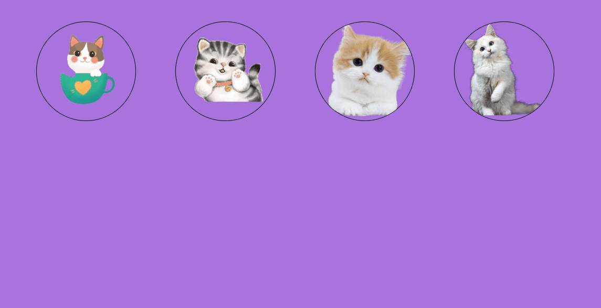

#### Porque os desafios não podem parar

#### Projeto desenvolvido para pratica e estudos de como centralizar imagens, testar responsividade.

#### A Pratica leva a Perfeição

[]

#### Projeto desenvolvido por Márcia Agostinho

[]

### Itens centralizados ao centro nos dois eixos

 <a href="https://www.linkedin.com/in/marcia-agostinho/ ">Linkedin</a>